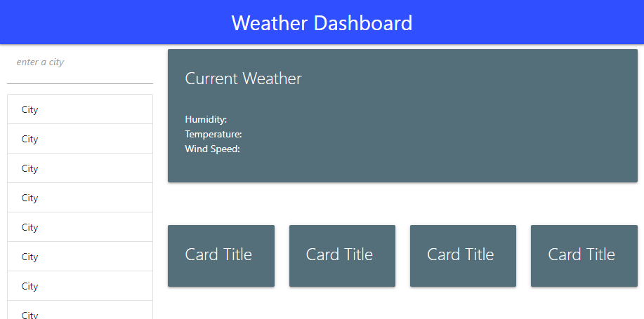

# 06_weather_dashboard

## Description

This is my weather dashboard that uses the openweather API, along with materialize as my CSS framework.

## challenges

for this assignment I struggled more with managing my time with my project then the assignment itself however I feel as though I need to be looking at an example for everything I do which I need to work on. For this assignment I decided to use examples little to none, which made it much harder for me.

## Links

Repo: https://github.com/Henryrjung/06_weather_dashboard
Pages: https://henryrjung.github.io/06_weather_dashboard/.

## Screenshot

## Credits

Openweather
Materialize
W3 Schools
class repo